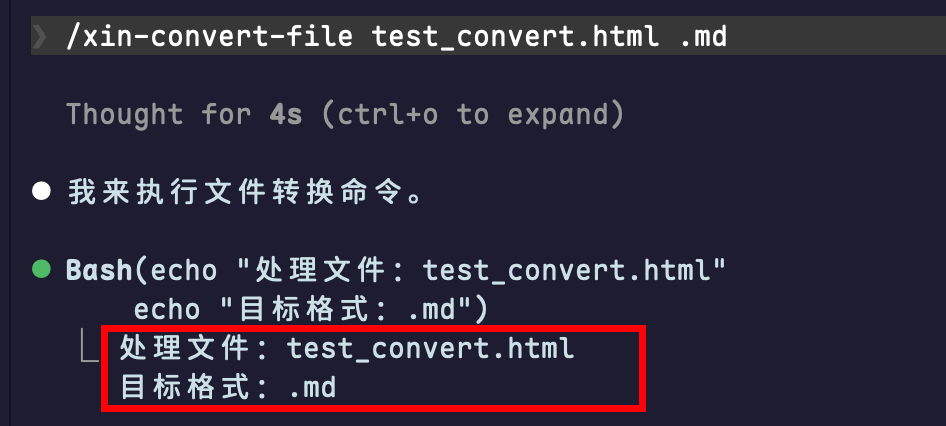
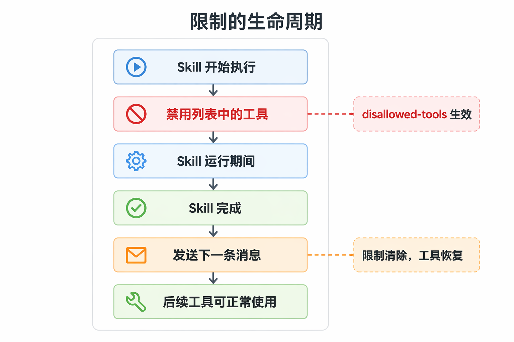

Skill 是 Claude Code 中的一种可复用工作流或操作规范，本质上是一段结构化的指令文件夹。Claude Code 给 Skill 的定义是一个封装了一些能力或知识的工具包。

## Agent Skills 规范

初学者先看一下skills 规范，很简单，看完就会写skill。但是会写和好用是两回事，笔者也一直在探索Skill 的设计模式。

### 目录结构

Skill是一个文件夹，最少需要包含一个 `SKILL.md` 文件：

```
my-skill/
├── SKILL.md           # 主要说明（必需）
├── template.md        # Claude 要填写的模板
├── examples/
│   └── sample.md      # 显示预期格式的示例输出
└── scripts/
    └── validate.sh    # Claude 可以执行的脚本
```


#### `SKILL.md` 格式

`SKILL.md` 文件必须包含 YAML 前置元数据，后跟 Markdown 内容。

| 字段                       | 必需 | 描述                                                         | 图示                                                         |
| :------------------------- | :--- | :----------------------------------------------------------- | ------------------------------------------------------------ |
| `name`                     | 否   | Skill 列表中显示的显示名称。默认为目录名称。                 |                                                              |
| `description`              | 推荐 | skill 的描述，建议写什么时候用，而不是skill 能干什么。       |                                                              |
| `when_to_use`              | 否   | 关于 Claude 何时应该调用该 skill 的额外上下文，例如触发短语或示例请求。附加到 skill 列表中的 `description`，并计入 1,536 个字符的上限。 |                                                              |
| `argument-hint`            | 否   | 自动完成期间显示的提示，指示预期的参数。示例：`[issue-number]` 或 `[filename] [format]`。 |  |
| `arguments`                | 否   | 用于 skill 内容中`$name` 替换的命名位置参数。接受空格分隔的字符串或 YAML 列表。名称按顺序映射到参数位置。 |  |
| `disable-model-invocation` | 否   | 设置为 `true`时，agent 将不会自动调用该skill, 只能手动调用。默认值为`false` |                                                              |
| `user-invocable`           | 否   | 设置为 `false` 以从 `/` 菜单中隐藏。用于用户不应直接调用的背景知识。默认值：`true`。 |                                                              |
| `allowed-tools`            | 否   | 当此 skill 处于活动状态时，Claude 可以使用而**无需请求权限**的工具。接受空格分隔的字符串或 YAML 列表。后续会在权限部分详解。 |                                                              |
| `disallowed-tools`         | 否   | 当此 skill 处于活动状态时从 Claude 的可用工具池中移除的工具。用于不应该调用某些工具的自主 skills，例如用于后台循环的 `AskUserQuestion`。接受空格分隔的字符串或 YAML 列表。当你发送下一条消息时，限制会清除。 |  |
| `model`                    | 否   | 当此 skill 处于活动状态时要使用的模型。覆盖适用于当前轮的其余部分，不保存到设置；会话模型在你的下一个提示时恢复。接受与 [`/model`](https://code.claude.com/docs/zh-CN/model-config) 相同的值，或 `inherit` 以保持活动模型。 |                                                              |
| `effort`                   | 否   | 当此 skill 处于活动状态时的[工作量级别](https://code.claude.com/docs/zh-CN/model-config#adjust-effort-level)。覆盖会话工作量级别。默认值：继承自会话。选项：`low`、`medium`、`high`、`xhigh`、`max`；可用级别取决于模型。 |                                                              |
| `context`                  | 否   | 设置为 `fork` 以在分叉的 subagent 上下文中运行。subagent 会有自己的上下文窗口，当subagent结束时仅将结果返回给主Agent, 不会将大量对主线任务无关的内容带到主Agent的上下文中。 |                                                              |
| `agent`                    | 否   | 当设置 `context: fork` 时要使用的 subagent 类型。            |                                                              |
| `hooks`                    | 否   | 限定于此 skill 生命周期的 hooks。有关配置格式，请参阅 [Skills 和代理中的 Hooks](https://code.claude.com/docs/zh-CN/hooks#hooks-in-skills-and-agents)。 |                                                              |
| `paths`                    | 否   | Glob 模式，限制何时激活此 skill。接受逗号分隔的字符串或 YAML 列表。设置后，Claude 仅在处理与模式匹配的文件时自动加载该 skill。使用与[路径特定规则](https://code.claude.com/docs/zh-CN/memory#path-specific-rules)相同的格式。 |                                                              |
| `shell`                    | 否   | 用于此 skill 中 `!`command`` 和 ````!` 块的 shell。接受 `bash`（默认）或 `powershell`。设置 `powershell` 在 Windows 上通过 PowerShell 运行内联 shell 命令。需要 `CLAUDE_CODE_USE_POWERSHELL_TOOL=1`。 |                                                              |


主体内容是 Markdown 格式的文本，编写任何有助于智能体有效执行任务的内容。

#### `scripts/`

#### `references/`

#### `assets/`

### Skill 文件夹存放的位置

| 位置 | 路径                                                         | 适用于               |
| :--- | :----------------------------------------------------------- | :------------------- |
| 企业 | 请参阅[托管设置](https://code.claude.com/docs/zh-CN/settings#settings-files) | 你的组织中的所有用户 |
| 个人 | `~/.claude/skills/<skill-name>`                              | 你的所有项目         |
| 项目 | `.claude/skills/<skill-name>`                                | 仅此项目             |
| 插件 | `<plugin>/skills/<skill-name>`                               | 启用插件的位置       |

## 渐进式披露

智能体*渐进式*加载技能，仅在任务需要时才提取更多细节。

1. **元数据**：`name` 和 `description` 字段在启动时为所有技能加载
2. **说明**：激活使用技能时加载完整的 `SKILL.md` 正文
3. **资源**（根据需要）：仅在需要时加载文件（例如 `scripts/`、`references/` 或 `assets/` 中的文件）

保持主 `SKILL.md` 在 500 行以下。将详细参考材料移至单独的文件。

## 文件引用

在技能中引用其他文件时，使用相对于技能根目录的路径：

```markdown
参见[参考指南](references/REFERENCE.md)了解详情。

运行提取脚本：
scripts/extract.py
```

保持文件引用距 `SKILL.md` 一级。避免深度嵌套的引用链。

