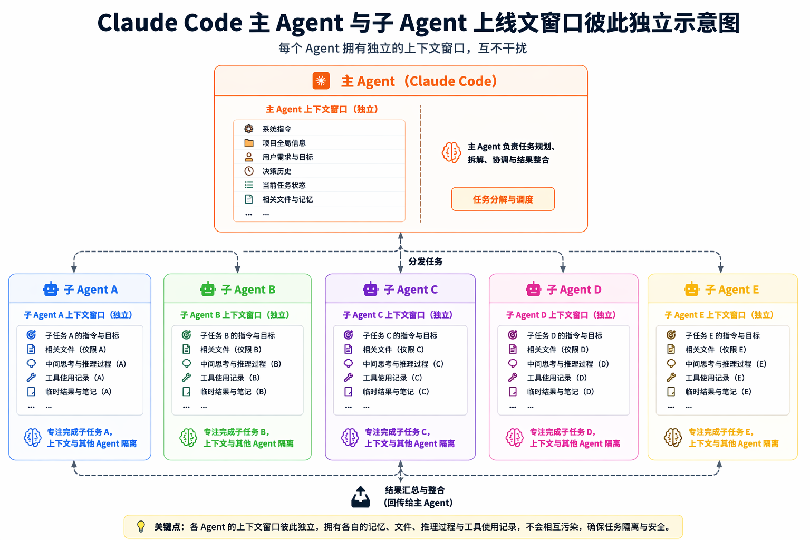
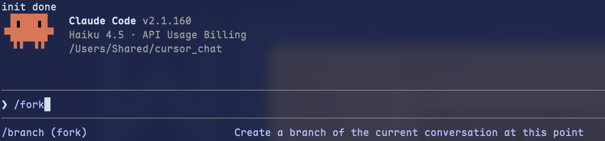
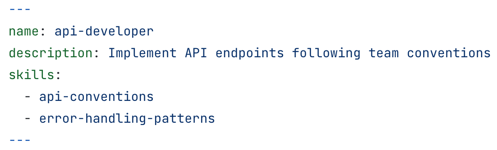

## 主子Agent

claude 启动时会默认生成一个主Agent，前边学习过 [宏观认识Claude code.md](宏观认识Claude code.md) ，知道主Agent的上下文窗口是有限的。当主Agent在执行主线任务时，避免不了会有一些不重要的或只需要知道结果不需要知道过程的支线任务（例如：从网络中进行搜索，只需要知道搜索后整理的结果，不需要知道搜索过程的明细数据），如果这些支线任务的内容统统放到主Agent的上下文中，就会污染主Agent的上下文，从而导致无法聚焦任务重点。



## subagent 分类

claude code 的subagent 可以分为两类：命名subagent, fork subagent。fork subagent 比较简单，我们先介绍。

### Fork subagent

fork subagent 就像git分支一样，是从主Agent中分叉出的一个临时分支，它继承到目前为止的整个对话，而不是从头开始。



可以使用`/frok`或`/branch` 手动启动一个subagent，启动后，该Agent就会变为一个新会话的独立主Agent，但是保留了源分支的上下文。当然还有其他创建fork agent 的方式，此处只需要了解如上内容足以，其他方式在涉及到的地方再详细介绍。

### 命名subagent

命名subagent可以理解为是为特定任务设计的名称确定的subagent。claude code 内置了几个subagent, 我们也可以自定义subagent。

如下表格是内置的subagent，自定义subagent将会单独在一个标题下介绍。

| 特性             | Explore                                                      | Plan                                                         | General-Purpose                                              |
| ---------------- | ------------------------------------------------------------ | ------------------------------------------------------------ | ------------------------------------------------------------ |
| **具体场景示例** | 这个项目有哪些文件？<br/>哪些地方调用了 getUserId()？<br/>这个模块的依赖关系是什么？ | 我进入 plan mode 来设计新功能<br/>需要先了解现有架构，再决定在哪里添加代码<br/>研究完后生成计划给用户审批 | 修复这个 bug（搜索→理解→修改→测试）<br/>重构这个模块（多文件改动→依赖调整→验证）<br/>复杂多步骤操作中需要代理独立完成 |
| **主要操作特点** | 只看不改，问题越具体越好                                     | 研究是为了生成计划，结束后提交计划（不直接执行修改）         | 需要实际修改代码，能处理复杂依赖关系                         |
| **分析深度选项** | quick / medium / very thorough                               | 单一深度                                                     | 单一深度                                                     |
| **模型**         | Haiku（固定，最快）                                          | 继承主对话模型                                               | 继承主对话模型                                               |
| **可用工具**     | 只读工具（Bash 读、Grep 等）                                 | 只读工具                                                     | 所有工具（含 Write、Edit）                                   |
| **能否修改代码** | ❌ 不能                                                       | ❌ 不能                                                       | ✅ 能                                                         |
| **何时选择**     | 只需快速搜索/理解，不需修改                                  | 在 plan mode 中需要研究代码库                                | 需要修改代码或多步骤操作                                     |
| **关键区别**     | 只读快速侦察兵                                               | plan mode 的研究助手                                         | 全能执行者                                                   |

## 自定义subagent

Subagents 是带有 YAML frontmatter 的 Markdown 文件。根据范围将它们存储在不同的位置。当多个 subagents 共享相同的名称时，更高优先级的位置获胜。

| Location                 | Scope              | Priority  | 如何创建                                                     |
| :----------------------- | :----------------- | :-------- | :----------------------------------------------------------- |
| 托管设置                 | 组织范围           | 1（最高） | 通过 [managed settings](https://code.claude.com/docs/zh-CN/settings) 部署 |
| `--agents` CLI 标志      | 当前会话           | 2         | 启动 Claude Code 时传递 JSON                                 |
| `.claude/agents/`        | 当前项目           | 3         | 交互式或手动                                                 |
| `~/.claude/agents/`      | 所有您的项目       | 4         | 交互式或手动                                                 |
| Plugin 的 `agents/` 目录 | 启用 plugin 的位置 | 5（最低） | 与 [plugins](https://code.claude.com/docs/zh-CN/plugins) 一起安装 |

### --agents

`--agents` 创建的subagent有点特别，它不是一个 Markdown 文件，而是在启动会话时通过json创建的一个subagent，生命周期仅限于当前会话。如下是一个例子, 在会话启动时创建了两个subagent `code-review`和`debugger`

```sh
claude --agents '{
    "code-reviewer": {
      "description": "Expert code reviewer. Use proactively after code changes.",
      "prompt": "You are a senior code reviewer. Focus on quality and security.",
      "tools": ["Read", "Grep", "Glob", "Bash"],
      "model": "sonnet"
    },
    "debugger": {
      "description": "Debugging specialist for errors and test failures.",
      "prompt": "You are an expert debugger. Find root causes and provide fixes."
    }
  }'
```

`--agents`有如下典型的使用场景

1. CI / 自动化脚本中即用即弃的 agent

```sh
claude --agents '{
  "validator": {"description":"Validate quality","prompt":"Check standards","tools":["Read","Grep"]},
  "fixer":     {"description":"Fix issues","prompt":"Fix code","tools":["Read","Edit","Write"]}
}' --print 
```

先校验质量，再修复发现的问题

2. 与 `--bare` 配合做最小化、可复现的 headless 运行

   `--bare`模式会跳过 CALUDE.md 自动发现等，需要显示地注入上下文。`--agents`与`--system-prompt` `--mcp-config` `--add-dir` 一样，都是在agent启动时手动添加上下文的方式。

### 编写subagent 文件

#### 支持的frontmatter字段

| Field             | 必需 | Description                                                  | 配置示例                                                     |
| :---------------- | :--- | :----------------------------------------------------------- | ------------------------------------------------------------ |
| `name`            | 是   | 使用小写字母和连字符的唯一标识符。                           |                                                              |
| `description`     | 是   | Claude 何时应该委托给此 subagent                             |                                                              |
| `tools`           | 否   | subagent 可以使用的工具，详见 [Claude可调用的工具.md](Claude可调用的工具.md) 。如果省略，继承所有工具。 |                                                              |
| `disallowedTools` | 否   | 要拒绝的工具，从继承或指定的列表中删除                       |                                                              |
| `model`           | 否   | agent 使用的模型`sonnet`、`opus`、`haiku`、完整模型 ID（例如，`claude-opus-4-8`）或 `inherit`。默认为 `inherit` |                                                              |
| `permissionMode`  | 否   | `default`、`acceptEdits`、`auto`、`dontAsk`、`bypassPermissions` 或 `plan`。对于 [plugin subagents](https://code.claude.com/docs/zh-CN/sub-agents#choose-the-subagent-scope) 被忽略。详见[权限模式 ](权限.md#权限模式) |                                                              |
| `maxTurns`        | 否   | subagent 停止前的最大代理轮数。不设置默认无限制，存在可能无限执行的风险，消耗token。保险起见，还是设置一下<br />假设你设置了 `maxTurns: 3`，一个典型的执行流程：<br />轮次 1: subagent 分析问题 → 调用 Grep 工具搜索文件 ✓ (计数)<br/>轮次 2: 基于搜索结果 → 调用 Read 工具阅读代码 ✓ (计数)<br/>轮次 3: 基于代码理解 → 调用 Edit 工具修改代码 ✓ (计数)<br/>轮次 4: 生成总结报告，无工具调用 ✗ (不计数) → 允许执行<br/>轮次 5: 用户提出新问题 → 尝试调用工具时被阻止 ❌ |                                                              |
| `skills`          | 否   | 在启动时加载skill到 subagent 的上下文中。注入完整的技能内容，而不仅仅是描述。通过此方式可以调用未出现在skill列表中的技能。<br />此方法可以保证skill 内容一定可以被加载到上下文，避免由于渐进披露导致需要的内容获取不到。 |  |
| `mcpServers`      | 否   | [MCP servers](https://code.claude.com/docs/zh-CN/mcp) 对此 subagent 可用。每个条目要么是引用已配置服务器的服务器名称（例如，`"slack"`），要么是内联定义，其中服务器名称为键，完整的 [MCP server config](https://code.claude.com/docs/zh-CN/mcp#installing-mcp-servers) 为值。对于 [plugin subagents](https://code.claude.com/docs/zh-CN/sub-agents#choose-the-subagent-scope) 被忽略 |                                                              |
| `hooks`           | 否   | [Lifecycle hooks](https://code.claude.com/docs/zh-CN/sub-agents#define-hooks-for-subagents) 限定于此 subagent。对于 [plugin subagents](https://code.claude.com/docs/zh-CN/sub-agents#choose-the-subagent-scope) 被忽略 |                                                              |
| `memory`          | 否   | `user`、`project` 或 `local`。启用跨会话学习                 |                                                              |
| `background`      | 否   | 设置为 `true` 以始终将此 subagent 作为 background 任务运行。默认：`false` |                                                              |
| `effort`          | 否   | 默认：从会话继承。详见[effort](琐碎内容.md#effort)           |                                                              |
| `isolation`       | 否   | 设置为 `worktree` 以在临时 [git worktree](https://code.claude.com/docs/zh-CN/worktrees) 中运行 subagent，为其提供存储库的隔离副本，默认从您的 [default branch](https://code.claude.com/docs/zh-CN/worktrees#choose-the-base-branch) 分支，而不是父会话的 `HEAD`。如果 subagent 不进行任何更改，worktree 会自动清理 |                                                              |
| `color`           | 否   | Subagent 在任务列表和转录中的显示颜色。接受 `red`、`blue`、`green`、`yellow`、`purple`、`orange`、`pink` 或 `cyan` |                                                              |
| `initialPrompt`   | 否   | 当此代理作为主会话代理运行时（通过 `--agent` 或 `agent` 设置），自动提交为第一个用户轮次。[Commands](https://code.claude.com/docs/zh-CN/commands) 和 [skills](https://code.claude.com/docs/zh-CN/skills) 被处理。前置于任何用户提供的提示 |                                                              |
